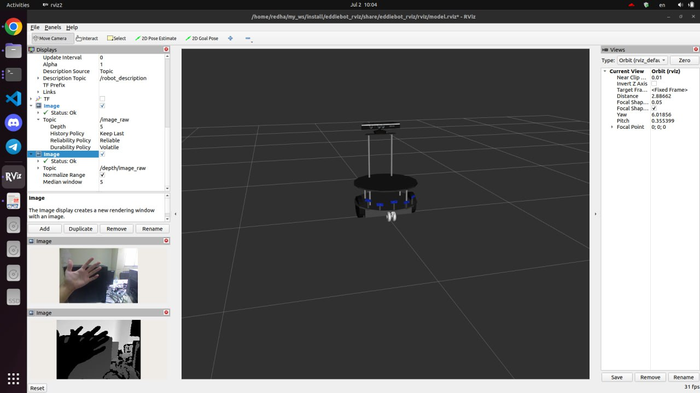
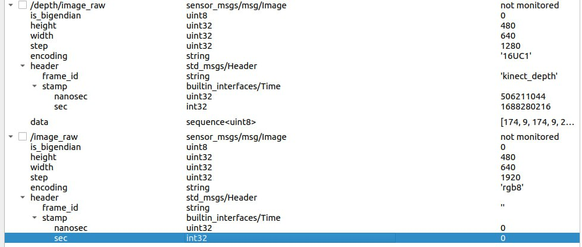
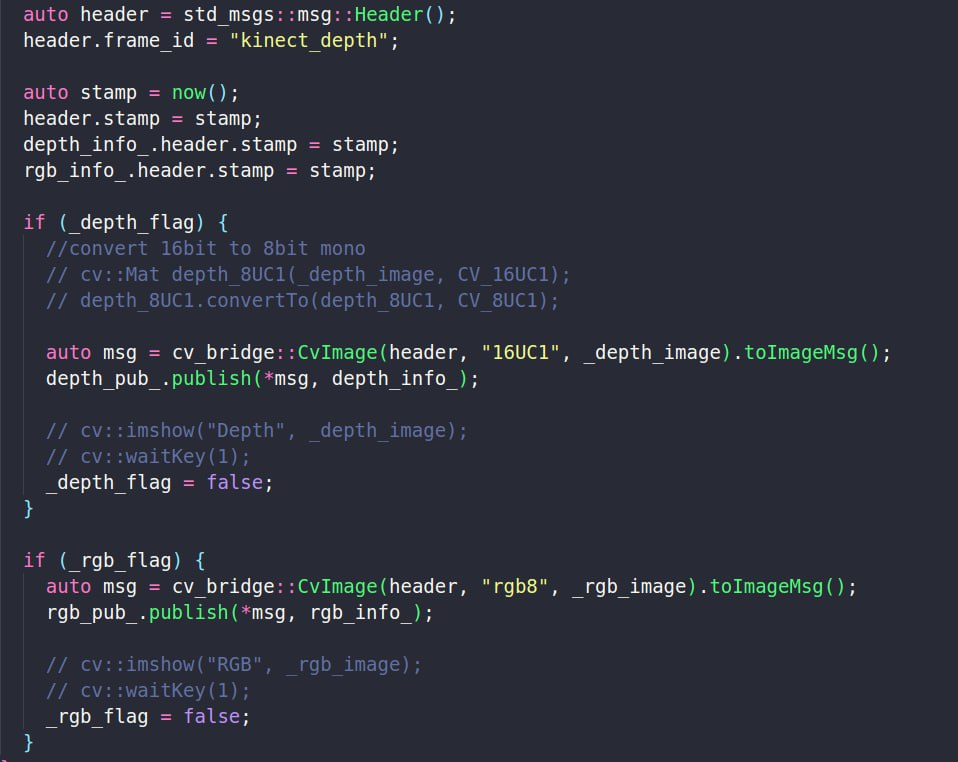
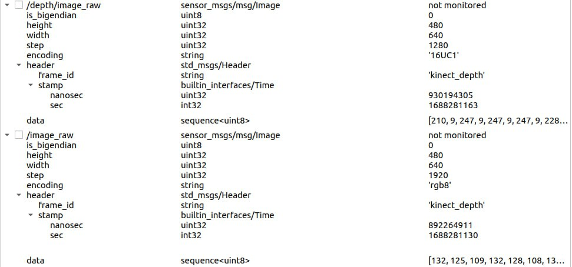

# Exercise 1
We bring up depth image and RGB image data of Microsoft Kinect xbox-360 using Kinect_ros2 package with IPC support, based on Libfreenect. Libfreenect is a user-space driver for Microsoft Kinect. Using freenect-glview command, RGB/depth image can be seen.
We also use the Kinect_ros2 executable node to publish the require data for other packages, the node has been spun in nav package of eddiebot, it can also execute and spin manually using “ros2 run kinect_ros2 kinect_ros2_node” command.
Here’s the output of RGB and depth image of Microsoft Kinect in rviz:

# Exercise 2
As shown below, when using rqt and listening to the related topics, the /image_raw does not have a valid timestamp.

The timestamp of /depth/image_raw has been set in Kinect_ros2_component.cpp code, the missing timestamp of /image_raw has been added similarly to the available timestamp. As shown below the rgb_info topic header.stamp also has been set to the timestamp (it was needed for rtabmap Kinect in exercise 7).

The result of the changes of the code can be seen below that the /image_raw topic has a timestamp in its header part.

# Exercise 3
eddiebot_bringup package launch file(eddie.launch.yaml) spin four distinct nodes for bringing up different data of robot to ros2. The nodes are:
- eddie -> for connecting to eddie board
- eddie_ping -> for reading distance sensors (infrared and ultrasonic) installed on robot
- eddie_adc -> for reading battery voltage level
- eddie_controller -> for interacting with robot velocity related parts

eddiebot_nav package launch file (eddiebot.launch.py) does the same as the eddiebot_bringup package launch file but for bringing up the data needed for navigating as below
- eddie_odom node from eddie_odom package -> explained in exercise 6
- eddie_vel_controller node from eddie_vel_controller package -> published cmd_vel topic data to eddie/cmd_vel topic
- kinect_ros2_node node from kinect_ros2 package -> explained in exercise 1
- Does a static transformation to kinect_depth frame in respect of camera_depth_optical_frame 
- Does a static transformation to kinect_rgb frame in respect of camera_rgb_optical_frame 
- depthimage_to_laserscan_node from depthimage_to_laserscan package -> converting the rgbd-camera data of Microsoft Kinect to be as same as laser scanner data
using teleop_twist_keyboard executable node in teleop_twist_keyboard, eddiebot can be controlled using keyboard button pushes through simple_velocity commands which brought up by the eddiebot to control its velocity.
Here’s the output of the view_model in rviz with using the argument “desctiption:=True”, it builds the tf tree of the robot related frames (the transformation between frames and child parent relation between them)

[Teleop video](https://youtube.com/shorts/rbCG_R9kxoA?feature=share)

# Exercise 4
If ROS_DOMAIN_ID has not been set, default value is equal to 0, ros2 machines on the same network can communicate via different ROS_DOMAIN_ID’s (up-to 128). 
In our case by using the ros2 run teleop_twist_keyboard teleop_twist_keyboard command eddiebot velocity controller related topics can be controlled by another ros2 machine.

[Network video](https://youtube.com/shorts/14_s8WRbBYM?feature=share)

# Exercise 5
By bringing up the rgbd-image of Microsoft Kinect data and convert it to fake laser scan data, slam can be done using slam_toolbox package.
After bringing up the required nodes for eddiebot (more explanation provided in previous exercises), robot odometry data calculated and published by eddiebot_nav package which also explained previously.
using this data and the fake laser scanner, slam_toolbox package can do the localization and mapping simultaneously for eddie robot.
We improved the slam_toolbox configuration for making the mapping process more reliable using this link by changing the variance penalty of distance from 0.3 to 0.5 and angular from 0.5 to 1.0, there parameters are related to scan matching in slam_toolbox package.
Using the output map of slam_toolbox mapping (The mapping process also has been recorded and is attached) navigation can be done by nav2 package. 
Nav2 package launch two launch files, first launches the nav2.yaml config file for specifying the nav2 parameters then nav2_bringup package is launched using the given param files. Nav2_bringup package spins multiple nodes related to navigating and planning the robot inside and outside the simulator.
For synchronizing the robot velocity and the trajectory of nav2 plan, robot velocity had to subscribe to the “cmd_vel” published topic of nav2 plan trajectory so it needed some changes.
“cmd_vel” topic’s frequency was too frequent for the eddie to execute the given command (mostly drive with speed command detected), so the nav2.yaml configuration file needed to be changed; This was implemented by changing the value of smoothing_frequency parameter (we figured the correct value by listening to the cmd_vel topic which was 20Hz by default and the set the value to the 0.2 for this part so the cmd_vel can be executed on eddie, this was done by experimenting different values).
Scale_velocities parameter is set to true for getting better performance (it will try to adjust all components to follow the same direction but still limits acceleration).
Min/Max velocity/acceleration are also decreased due to safety issues.
Xy/yaw_goal_tolerance can be changed to achieve goal state smoothly without being too precise.

[Slam video](https://youtube.com/shorts/jVgVwJULtfY?feature=share)
[Nav video](https://youtube.com/shorts/NobdCORuf48?feature=share)

# Exercise 6
Eddiebot uses edditbot_odom package to compute its odometry and publish it to the “odom” topic. Commonly odometry is calculated using wheel encoders, IMU, etc. In our case, with the lack of viable sensors, the package only uses wheel encoders data through subscribing to the “eddie/encoders_data” topic which is provided by eddiebot_bringup package.
Eddiebot_nav package is used for navigation by creating multiple nodes such as eddiebot_odom. It executes the eddie_odom executable node from eddiebot_odom package for further computation.
For every callback of “eddie/encoders_data” topic in eddibot_odom package the node calculates x_ (absolute position in x-axis), y_ (absolute position in y-axis) and th_ (absolute rotation in z-axis).
With the parameters below defined in the provided library x_, y_ and th_ can be calculated.
	WHEEL_RADIUS which determines the radius of robot’s wheels that is set as 0.1524.
	COUNTS_PER_REVOLUTION is the encoder counter per each wheel revolution which is set to 36 as default.
	WHEEL_BASE which defines the distance between centers of wheels that is set to 0.39 as default.
	DISTANCE_PER_COUNT which can be calculated as below, is the distance each wheel takes to be increased by one.
(π^2* WHEEL_RADIUS)/(COUNTS_PER_REVOLUTION)
The formula can be explained by using division of the perimeter of wheels and their revolution counts.
By using mentioned parameters, the goal which is using odometry for computing navigation can be achieved. 
First of all, the total number of ticks for each wheel needs to be calculated with using the difference between the current and previous number of ticks on each wheel.
	delta_left_cnt =current number of ticks-previous number of ticks of the left encoder
	delta_right_cnt =current number of ticks-previous number of ticks of the right encoder
Secondly the changes of x, y and theta can be monitored and computed using below formulas.
	delta_th =  ((delta_right_cnt  -delta_left_cnt )  * DISTANCE_PER_COUNT)/(WHEEL_BASE)
By calculating the difference between left and right wheel’s number of ticks the whole number of ticks of the robot is computed and the distance of the robot’s movement is resulted by multiplying the DISTANCE_PER_COUNT parameter and by dividing WHEEL_BASE parameter the angle of rotation of the robot (yaw) is calculated.
	delta_x = (delta_right_cnt  + delta_left_cnt )  * DISTANCE_PER_COUNT *  cos⁡(th_)
With using summation of number of ticks of right and left wheels the whole robot’s movement in total is computed and converted to meters with multiplying by DISTANCE_PER_COUNT. As the result the movement along x axis is calculated by multiplying cosine of the theta angle to the whole robot’s movement. 
	delta_y = (delta_right_cnt  + delta_left_cnt )  * DISTANCE_PER_COUNT *  sin⁡(th_)
For calculating the whole movement along y axis the sinus is used and the result formula is shown above.
Now using the formulas above, x_, y_ and th_  can be defined as:
	x_=x_ (previous data)  +delta_x (movement along x axis)
	y_=y_ (previous data)  +delta_y (movement along y axis)
	th_=th_ (previous data)  +delta_th (rotation along z axis)
Due to their values being absolute in the map, their values need to be updated with the new movements/rotations along related axes.
Then we can use them in order to create messages to transform over tf and odometry over ros:
	odom_trans.transform.translation.x=x_
odom_trans.transform.translation.y=x_
odom_trans.transform.rotation=odom quaternion of th_
	odom.pose.pose.position.x=x_
odom.pose.pose.position.y=y_
odom.pose.pose.orientation=odom quaternion of th_
The odom quaternion of th_ parameter is related to using quaternion functions to calculate rotation in 3 axes in resect to the coordinate frame using the theta calculated value.
And to set the velocity the formulas are as mentioned below:
	odom.twist.twist.linear.x=(delta_x)/dt
odom.twist.twist.linear.y=(delta_y)/dt
odom.twist.twist.angular.z=(delta_th)/dt
Which dt is defined as dt= (current_time-last_time ).seconds() and by dividing the whole movement/rotation along each axis by the consumed time of the movement/rotation to get each velocity correctly.

# Exercise 7
Other method to do slam for mobile robots is using visual slam with using of robot’s camera data (such as depth-image, rgb-image, and etc.), there are multiple packages which can be used to achieve vslam (with different approaches to feature-detection, point clouds 3D, 2D grid_map, and etc.). 
In our case we are using rtabmap package, the package provides so many alternative ways of doing slam, the chosen one is similar to exercise 5 by converting the rgbd-image of Microsoft Kinect to fake laser scan and using odometry (only wheel encoders in our case) data to achieve slam; It has been done by the rtabmap.launch.py launch file, the launch file launches some other launch files:
	rtabmap node from rtabmap_slam package, if the localization argument value set to false (default value) the launch file with desired set of parameters launches, the node do the slam and save the map in /home/.ros directory (.db format).
	If the localization argument value set to true the previous map is going to be loaded with the same launch file above.
	Rtabmap_viz, is a modified rviz lookalike platform which provides live feature-point detection, some unique environment with unique IDs.
	We also include one more package to be launched, the eddiebot_description node which brought up the tf tree of the robot needed frames (with description parameter to be used as a condition).
Another challenge additionally to the transform between frames was Kinect frames timestamps which needed to be set in kinect_ros2 package.
Rtabmap Challenges:
	Kinect is too sensitive to blurriness of the image which can be tricky with our robot because of the placement of Kinect camera, to fix this issue we can add some parameters to approximate between frames such as RGBD/ProximityPathMaxNeighbors, another alternative way is to move the robot in only straight direction and also set camera’s head down for matching less feature-points and prevent shaking too much.
	To have a better understanding of the mapping process of slam, we recorded live mapping progress in rviz, the output had the issue of not being precise with rotations because of:
	Not reliable odometry available for eddie robot.
	Not being able to match feature points due to shaky camera and blurring problems.
As seen in the recordings, the rotations were so off (for example getting 180-degree rotation in rviz with only rotating the robot for 90-degree).
To fix the issue, tf-delay parameter was tested but the output wasn’t desirable.
	Initial pose always sets by rtabmap_slam package using the Kinect image data and cannot be set manually, so the environment cannot be change often (like brightness, start pose related to fixed obstacles, and etc.)
	To do robot navigation, by using the same approach we used in Ex.5; listening to /cmd_vel topic while using the rtabmap, the topic frequency was 10Hz while sending only linear velocity command which was different to pure rotation which was 6Hz, using the same tactic as shown in Ex.5, smoothing_frequency parameter seems to be set to 0.1 but the result is not satisfying for rotation

[Slam video](https://youtube.com/shorts/tpVd0QMH0XY?feature=share)
[Nav video](https://youtube.com/shorts/RgtjkbZfwvE?feature=share)
[Map rotation problem](https://youtu.be/w_zrhgBISSQ)
[Map rotation problem using TF_delay](https://youtu.be/di4a_sXJpTw)
